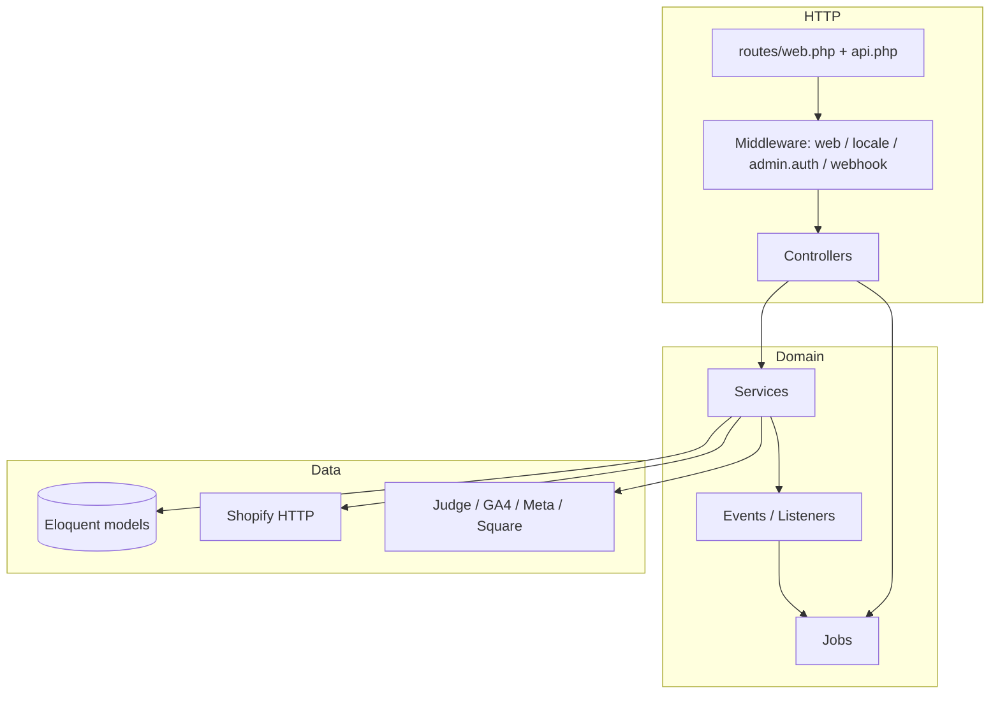
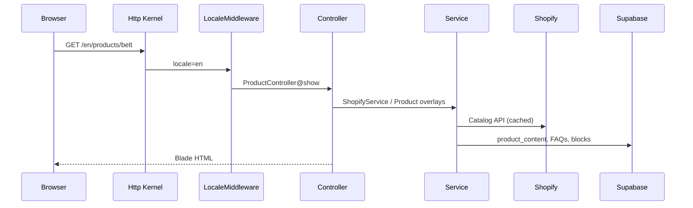
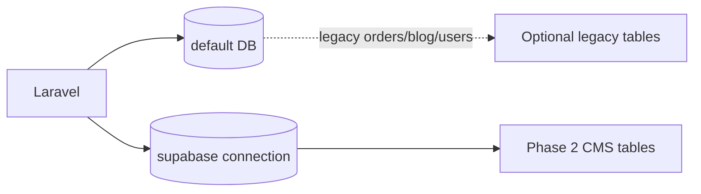

# Application Architecture

## Mental model

Laravel MVC still applies, but **Services** hold most domain logic. There is **no repository layer**.

---

## Request lifecycle (storefront)

1. `public/index.php` → HTTP Kernel.
2. Global middleware (proxies, CORS, maintenance, trim strings).
3. `web` group: cookies, session, CSRF, bindings, `TrackPageViews`.
4. Route `{locale}` + `locale` middleware sets app locale.
5. Controller loads data via Services (Shopify + Supabase).
6. Blade view rendered; Alpine hydrates interactive bits (cart drawer, etc.).

---

## Admin request flow

1. `/admin/login` — compare email/password to `ADMIN_EMAIL` / `ADMIN_PASSWORD` (config/`env`).
2. Session flag `admin_authenticated = true`.
3. `admin.auth` middleware guards `/admin/*` CRUD.
4. Controllers write to Supabase models; may dispatch search index jobs via model `booted()` hooks.

No Spatie roles/policies on Admin today. See [Permissions](Permissions.md).

---

## Service layer

Preferred place for:

- External API calls
- Cart/checkout orchestration
- Search indexing helpers
- Analytics tracking
- Review caching

Controllers should stay thin. See [Services](Services.md).

---

## Repository layer

**Not present.** Do not introduce repositories unless there is a clear need (e.g. multiple storage backends). Prefer extending existing services.

---

## Events & queues

| Piece | Role |
|-------|------|
| `AnalyticsEventOccurred` | Fired after analytics track |
| `DispatchAnalyticsExportJobs` | Queues GA4 + Meta jobs |
| `UpdateSearchIndexJob` | Rebuild FTS row |
| `SyncProductJob` | Upsert `dainely_products` from Shopify payload |
| `ProcessWebhookJob` | Judge / video-ai / wallpass processing |
| `RetryFailedWebhooksJob` | Scheduled retry |

Default `QUEUE_CONNECTION=sync` runs jobs inline. Production should use a real queue worker for reliability. See [Queues](Queues.md).

---

## Scheduled jobs

In `app/Console/Kernel.php`:

- `reviews:warm-cache` — hourly
- `RetryFailedWebhooksJob` — every five minutes

Host must run `php artisan schedule:run` via cron every minute.

---

## Middleware flow (important aliases)

| Alias | Class | Purpose |
|-------|-------|---------|
| `locale` | `LocaleMiddleware` | Validate/set locale from route |
| `admin.auth` | `AdminAuth` | Session gate for CMS |
| `webhook.shopify` | `VerifyShopifyWebhook` | HMAC validation |
| `web` group | includes `TrackPageViews` | Page-view analytics |

API group uses Laravel throttle middleware.

---

## Authentication & authorization

| Area | Mechanism |
|------|-----------|
| Storefront customers | Not a first-party user account system for shopping; Shopify owns checkout identity |
| Admin | Shared env credentials + session |
| Webhooks | HMAC / optional bearer secrets |
| Laravel `User` + Sanctum | Scaffold present; not the Admin CMS path |

Authorization = middleware gates, not Policy classes.

---

## Dual database pattern

Always set `$connection = 'supabase'` on Phase 2 models. Migrations for those tables use `Schema::connection('supabase')`.

---

## Extension points

- New landing block type → migration/content JSON + `resources/views/components/blocks/{type}.blade.php` + Admin form field
- New searchable entity → implement `SearchableEntity` + wire `UpdateSearchIndexJob` / `SearchService::reindexAll`
- New webhook source → route + `ProcessWebhookJob` match arm + `config/webhooks.php` secrets
- New analytics destination → listener/job from `AnalyticsEventOccurred`
