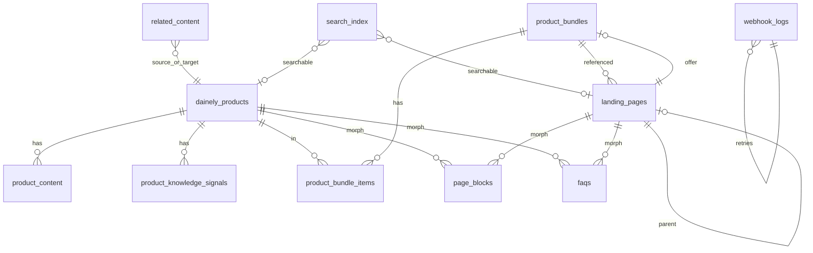

# Database Documentation

## Connections

| Name | Driver | Env prefix | Used for |
|------|--------|------------|----------|
| `default` | From `DB_CONNECTION` | `DB_*` | Legacy Laravel tables when enabled |
| `supabase` | `pgsql` | `DB_SUPABASE_*` | Phase 2 CMS / catalog mirror |

Requires PHP **`pdo_pgsql`** for the supabase connection.

---

## ER diagram (Phase 2 / Supabase)



Polymorphic tables (`page_blocks`, `faqs`, `search_index`, `ai_schema_cache`, `recommendation_rules`) use `*_type` / `*_id` morph columns.

---

## Supabase tables

### `dainely_products`

| | |
|-|-|
| **Purpose** | Local mirror of Shopify products for CMS + search |
| **Important columns** | `shopify_product_id`, `variant_id`, `sku`, `handle`, `title`, `status`, `price`, `compare_at_price`, `inventory`, `featured_image`, `synced_at` |
| **Keys / indexes** | Unique `shopify_product_id`, unique `handle` |
| **Relationships** | `hasMany` content, signals, bundle items; morph FAQs/blocks |

### `product_content`

| | |
|-|-|
| **Purpose** | Locale overlays (title, description, SEO fields) |
| **Important columns** | `product_id`, `locale`, content/SEO fields |
| **Relationships** | `belongsTo` Product |

### `landing_pages`

| | |
|-|-|
| **Purpose** | Marketing landings per locale slug |
| **Important columns** | `slug`, `locale`, `title`, meta fields, `published`, `parent_id`, offer fields (`bundle_id`, product offer, `discount_code`, …) |
| **Keys** | Unique (`slug`, `locale`) |
| **Relationships** | parent/children, bundle, morph blocks/FAQs |

### `page_blocks`

| | |
|-|-|
| **Purpose** | Ordered content blocks for products, landings, education |
| **Important columns** | `blockable_type`, `blockable_id`, `type`, `content` (JSON), `sort_order`, visibility |
| **Relationships** | `morphTo` blockable |

### `faqs`

| | |
|-|-|
| **Purpose** | Polymorphic FAQs |
| **Important columns** | `faqable_*`, `locale`, `question`, `answer`, `sort_order`, `approved` |
| **Indexes** | (`faqable_type`, `faqable_id`, `locale`) |

### `product_knowledge_signals`

| | |
|-|-|
| **Purpose** | Discoverability / AI knowledge claims for products |
| **Important columns** | `product_id`, signal payload fields, approval flags |
| **Scopes** | `approved` |

### `related_content`

| | |
|-|-|
| **Purpose** | Directed links between content entities |
| **Important columns** | source/target type+id, sort/order fields |

### `product_bundles` / `product_bundle_items`

| | |
|-|-|
| **Purpose** | Bundle definitions and line items |
| **Relationships** | Bundle `hasMany` items; item `belongsTo` product |

### `ai_schema_cache`

| | |
|-|-|
| **Purpose** | Cached JSON-LD / schema fragments |
| **Relationships** | `morphTo` cacheable |

### `analytics_events`

| | |
|-|-|
| **Purpose** | Server-side analytics event log |
| **Important columns** | `event_name`, `event_data` (JSON), `user_id`, `occurred_at` |

### `user_activity_log`

| | |
|-|-|
| **Purpose** | Coarse user/item activity |
| **Important columns** | event type, morph item, context |

### `search_index`

| | |
|-|-|
| **Purpose** | Denormalized FTS documents |
| **Important columns** | `searchable_*`, `locale`, `title`, `body_plain`, `keywords`, `tsv` (tsvector) |
| **Indexes** | GIN on `tsv` (`search_idx`), locale index |

### `webhook_logs`

| | |
|-|-|
| **Purpose** | Inbound webhook audit + retry state |
| **Important columns** | `source`, `event_type`, `payload`, status, retry counters/timestamps |
| **Scopes** | `retryable`, `dead` |

### `recommendation_rules`

| | |
|-|-|
| **Purpose** | Cart recommendation mappings |
| **Relationships** | morph source / recommended item |

---

## Legacy / default-connection tables (migrations present)

These exist from earlier scaffolding. Phase 2 CMS prefers Supabase. Treat as **optional / legacy** unless your deploy still uses them:

`users`, `password_reset_tokens`, `personal_access_tokens`, `failed_jobs`, `jobs`, `languages`, `currencies`, `products`, `product_translations`, `pages`, `blog_posts`, `faqs` (default), `orders` (+ items), `discount_codes`, `testimonials`.

Orders may still be written by `OrderPersistenceService` depending on checkout path.

---

## Relationship summary

- Product mirror ↔ content overlays (1:N by locale).
- Products / landings / education ↔ blocks & FAQs via morphs.
- Landings may nest (`parent_id`) and attach a bundle offer.
- Search index is a denormalized projection; keep in sync via jobs/model hooks.
- Webhook logs drive async processing and retries.

---

## Migration history (Phase 2 focus)

| Migration | Notes |
|-----------|-------|
| `2026_07_10_*` | `dainely_products`, `product_content` |
| `2026_07_11_*` | FAQs, landings, blocks, signals, related, AI cache, bundles, analytics, activity, search, webhooks, recommendations |
| `2026_07_12_*` | Align / finalize Phase 2 schema (drop legacy columns, GIN index) |
| `2026_07_13_*` | Webhook retry columns |
| `2026_07_14_*` | Landing parent, offer meta, discount_code |

Run with the supabase connection configured. Prefer Session **pooler** host from shared hosting.

```bash
php artisan migrate
# Ensure DB_SUPABASE_* is set; supabase migrations target that connection.
```
