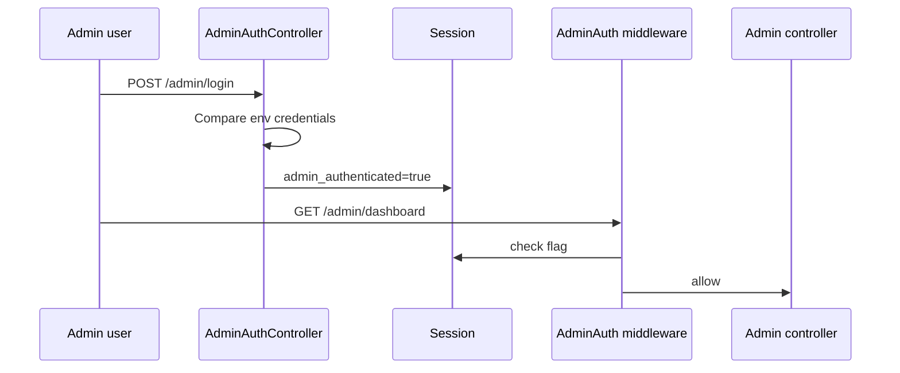

# Permissions & Authorization

## Summary

This project does **not** currently implement a multi-role CMS permission matrix. Admin access is a **single shared credential** gated by middleware.

`spatie/laravel-permission` is installed via Composer but **is not wired into the Admin CMS flow**. Do not assume roles/permissions tables are in use unless you add that work.

---

## Roles

| Role | Reality today |
|------|----------------|
| Storefront visitor | Anonymous; cart in session |
| Admin | Anyone with correct `ADMIN_EMAIL` / `ADMIN_PASSWORD` |
| Shopify / webhook callers | Machine auth via HMAC/bearer |

---

## Permissions

No per-resource permissions (e.g. “edit landings but not bundles”). All authenticated admins can use all Admin routes.

---

## Policies

No Laravel Policy classes are used for Admin resources.

---

## Middleware

| Middleware | Behavior |
|------------|----------|
| `admin.auth` (`AdminAuth`) | Requires `session('admin_authenticated')`; else redirect to `/admin/login` |
| `webhook.shopify` | Validates Shopify HMAC |
| `auth` / `can` | Standard Laravel aliases exist; not the Admin path |

---

## Authorization flow

Logout clears the session flag.

---

## Webhook authorization

Separate from Admin:

- Shopify: HMAC secret
- Judge / Video AI / Wallpass: optional secrets/bearers in `config/webhooks.php`
- Square: signature validation

---

## Hardening recommendations (future)

If you need real RBAC:

1. Introduce Admin users table (or Supabase auth) instead of shared password.
2. Optionally adopt Spatie roles already in Composer.
3. Add Policies per resource.
4. Document MFA if `ADMIN_MFA_ENABLED` becomes real enforcement (today it is primarily an env flag in `.env.example`).

Until then: protect `/admin` with HTTPS, strong unique password, and host-level access controls where possible.
