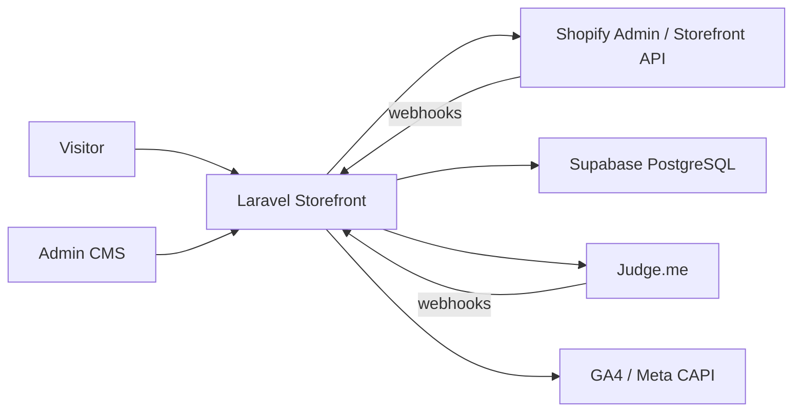

# Dainely Premium Wellness — Project Overview

Developer documentation for the Laravel storefront and Phase 2 Admin CMS.

| Doc | Purpose |
|-----|---------|
| [Folder-Structure](Folder-Structure.md) | What lives where |
| [Features](Features.md) | Feature catalog |
| [Architecture](Architecture.md) | Request flow, layers, diagrams |
| [Database](Database.md) | Tables, ER diagram |
| [Routes](Routes.md) | Route modules |
| [Models](Models.md) | Eloquent models |
| [Services](Services.md) | Service layer |
| [API](API.md) | Webhooks & JSON endpoints |
| [Queues](Queues.md) | Jobs, events, schedule |
| [Integrations](Integrations.md) | Shopify, Supabase, Square, etc. |
| [Environment](Environment.md) | Env vars (no secrets) |
| [Configuration](Configuration.md) | Config files |
| [Permissions](Permissions.md) | Admin auth |
| [Frontend](Frontend.md) | Blade, Alpine, Vite |
| [Deployment](Deployment.md) | Deploy & ops |
| [Cloudflare](Cloudflare.md) | CDN + edge HTML cache rules |
| [Testing](Testing.md) | PHPUnit |
| [Troubleshooting](Troubleshooting.md) | Common failures |
| [Coding-Standards](Coding-Standards.md) | Conventions |
| [Developer-Guide](Developer-Guide.md) | 30-minute onboarding |
| [AI-Guide](AI-Guide.md) | For AI coding assistants |
| [CodeMap](CodeMap.md) | “Where is X?” index |
| [CHANGELOG](CHANGELOG.md) | Major changes |

---

## Project purpose

**Dainely** is a multilingual e-commerce site for premium wellness / DME products.

- **Shopify** owns products, inventory, and preferred checkout.
- **Laravel** owns the marketing storefront (EN / FR / DE), SEO, content overlays, landings, search, analytics, and a lightweight Admin CMS.
- **Supabase (PostgreSQL)** stores Phase 2 CMS data (product overlays, FAQs, landings, bundles, search index, analytics, webhooks).

Live example: `dev.dainelylab.com`.

---

## High-level architecture

**Rule of thumb:** price and stock come from Shopify; copy, FAQs, blocks, and related links can be overridden in Supabase via Admin.

---

## Technology stack

| Layer | Choice |
|-------|--------|
| Framework | Laravel **10.x** (`laravel/framework ^10.10`) |
| PHP | **^8.1** (local/dev often **8.3**) |
| Frontend | Blade + **Alpine.js** + **Tailwind CSS** + Vite |
| Default DB | Configurable (`DB_CONNECTION`; often `pgsql` or `mysql`) |
| CMS / Phase 2 DB | Dedicated connection `supabase` (PostgreSQL) |
| HTTP client | Guzzle |
| Auth packages | Laravel Sanctum (present); Admin uses **session credentials**, not Sanctum |
| Permissions package | `spatie/laravel-permission` (installed; Admin does **not** use roles yet) |
| Redis client | `predis/predis` (optional) |

---

## Main third-party packages

- `laravel/framework`, `laravel/sanctum`, `laravel/tinker`
- `guzzlehttp/guzzle`
- `spatie/laravel-permission`
- `predis/predis`
- Dev: PHPUnit 10, Pint, Sail, Collision, Ignition

Frontend (npm): Alpine, Tailwind 3, Vite 5, Axios, `@alpinejs/collapse`.

---

## Database

| Connection | Role |
|------------|------|
| `default` (`DB_*`) | Legacy Laravel tables (users, orders, blog, etc.) when used |
| `supabase` (`DB_SUPABASE_*`) | Phase 2 catalog/CMS: `dainely_products`, `landing_pages`, `faqs`, `search_index`, … |

**Important:** catalog products live in table **`dainely_products`** (not `products`) to avoid colliding with an existing client table named `products`.

Host must have PHP extension **`pdo_pgsql`** enabled for Supabase/Admin. Without it, storefront can still use Shopify; Admin CMS will fail. See [Troubleshooting](Troubleshooting.md).

---

## Storage / queue / cache

| Concern | Default (`.env.example`) |
|---------|---------------------------|
| Filesystem | `local` |
| Queue | `sync` (use `database`/`redis` in production for async jobs) |
| Cache | `file` |
| Session | `file` |
| Search | PostgreSQL **full-text** on `search_index.tsv` (`simple` config) — not Elasticsearch |

---

## External APIs

| Integration | Use |
|-------------|-----|
| Shopify Admin + Storefront | Catalog, checkout, tax, discounts, orders |
| Square | Optional payment fallback |
| Judge.me | Product reviews |
| Open Exchange Rates | FX for display currencies |
| ipapi / geo | Locale auto-redirect |
| GA4 Measurement Protocol | Server-side analytics |
| Meta Conversions API | Server-side ads events |
| Trustpilot | Business unit display (config) |
| Supabase | PostgreSQL + optional REST keys |

Details: [Integrations](Integrations.md).

---

## Overall application flow

1. Visitor hits `/` → geo/cookie locale → redirect to `/{locale}/`.
2. Locale middleware sets `app()->setLocale()`.
3. Pages load Shopify products (API/cache) + optional Supabase overlays (content, FAQs, blocks, related).
4. Cart lives in session; checkout prefers **Shopify native checkout**; Square remains a fallback when enabled.
5. Events go through `AnalyticsEventService` → DB + optional GA4/Meta jobs.
6. Shopify/Judge/etc. webhooks hit `/api/webhooks/*` or `/webhooks/*`, validate signatures, queue processors.
7. Admins manage CMS at `/admin/*` after env-based login.

---

## Documentation maintenance

When you add or change a module, table, API, service, or integration, update the matching file(s) in `docs/` in the same PR. Prefer linking over copying.
